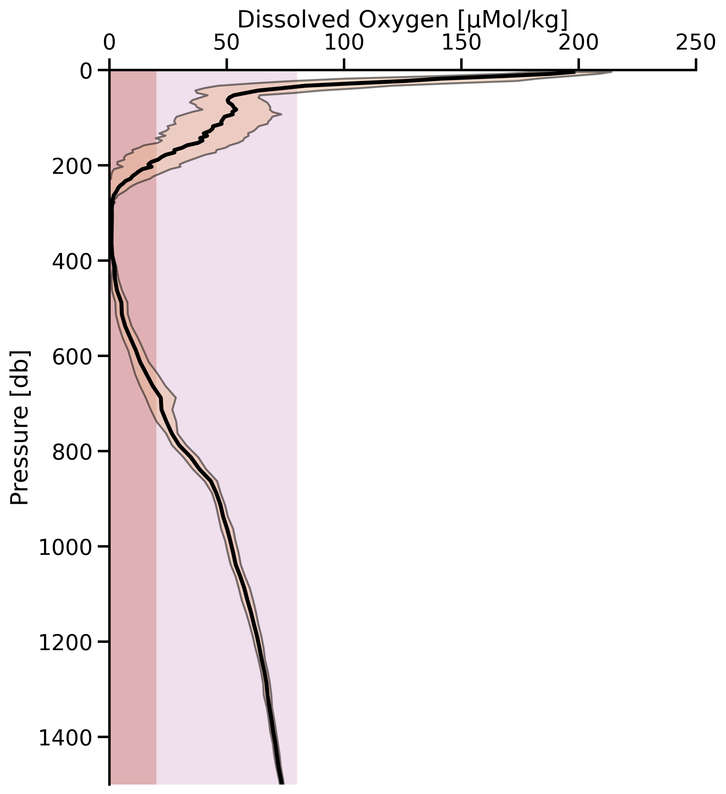

# Example: Plotting Argo Data
Example plot for argos float data off of the shelf in Northern Peru.
---
Run the notebook `argos_profine_plot.ipynb` to load and generate plots from the argos data found in the `example_data` directory. Data are organized as a single text file with each cast appened to the last.

